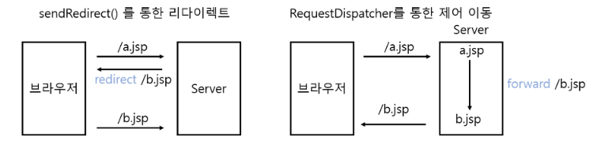

### 6.1 서블릿/JSP로 회원관리 기능 다시 개발하기

```java
req.setAttribute("users", DataBase.findAll());
```
- JSP에 "users"라는 이름으로 전달
- 서블릿도 동적으로 HTML을 생성하려면 StringBuilder를 통해 하나한 구현해줘야함
- 이 같은 서블릿의 한계를 극복하기 위해 등장한 것이 **JSP**이다

#### JSP(Java Server Page)
- JSP는 정적인 HTML은 그대로 두고 동적으로 변경되는 부분만 JSP 구문을 활용해 프로그래밍으로 구현하면 된다
- 자바 구문을 그대로 사용할 수 있다
- 스크립틀릿(scriptlet) 이라고 하는 <% %> 내에 자바 구문을 그대로 사용할 수 있게 되었다
- 근데 많은 로직이 JSP에 자바 코드로 구현되다보니 JSP를 유지보수하기 힘들어졌다
- 그래서 나온 것이 **JSTL(JavaServer Pages Standard Library) 와 EL(Expression Language)** 이다
  - JPS의 복잡도를 낮춰 유지보수를 쉽게 하자는 목적으로 MVC 패턴을 적용한 프레임워크
  - JSTL과 EL을 활용하면 JSP에서 자바 구문을 완전히 제거할 수 있다

#### 고민
1. UserUpdateServlet과 UserUpdateFormServlet을 나누는 것이 맞는가?
```java
@WebServlet(value = { "/user/update", "/user/updateForm" })
```
- 이렇게 하나의 서블릿에 여러개 uri를 걸 수 있다! 
- 근데 이렇게 하면 1개의 doGet(), 1개의 doPost()만 가능하다
- 대신 "/user/update"로 시작하는 uri 를 if문으로 분기별로 나눠서 다른 로직이 돌아가게는 처리가능
  - "/user/update/name", "/user/update/email" 이렇게?

2. "/" HomeServlet 만들기
```java
@WebServlet("")
public class HomeServlet extends HttpServlet {
    @Override
    protected void doGet(HttpServletRequest req, HttpServletResponse resp) throws IOException, ServletException {
        RequestDispatcher dispatcher = req.getRequestDispatcher("/index.jsp");
        dispatcher.forward(req, resp);
    }
}
```
- `@WebServlet("/")`로 처음에 만들었는데 `/`가 아닌 그냥 `""`로 해야 작동!
- `@WebServlet("/")` 
  - 모든 요청을 가로채는 default servlet mapping 역할
  - 정적 리소스(.css, .js 등) 까지도 이 서블릿이 처리하려고 하여 CSS가 안먹거나 리소스 404 에러가 발생할 수 있음
- `@WebServlet("")`
  - `http://localhost:8080/` 만 매핑된다
  - 정적 리소스 요청은 tomcat의 DefaultServlet이 그대로 처리하기에 CSS/JS 잘 동작함

3. session에서 값 가져오는 거 클래스로 만들기
- jwp-basic 레포 보고 만듦!

4. Exception을 만들어야할까?
- 완성도를 높이려면 하는 게 좋겠지만,, 오류가 일어나도 프론트단에서 뭐 보여줄 게 아니니 그냥 패스

5. `redirect("/user/list")` vs `redirect("/user/list.jsp")`
   - 후자로 하니까 세션을 못읽어와서 유저 목록이 출력 안되는 문제 발생
   - 찾아보니 JSP 파일에 직접 접근하게 되면 서블릿을 거치지 않기 때문에 세션체크 로직이 돌아가지 않아서 그런거였음
   
6. RequestDispatcher로 forward 하는 것과 그냥 redirect의 차이는 무엇인가?
- RequestDispatcher
  - 클라이언트로부터 최초에 들어온 요청을 JSP/Servlet 내에서 원하는 자원으로 요청을 보내는 역할을 수행
  - 특정 자원에서 처리를 요청하고 처리 결과를 얻어오는 기능을 수행


- Redirect -> sendRedirect()
  - 새로운 페이지로 완전히 이동해서 기존 데이터를 하나도 사용할 수 없다
  - 새로운 request라서 req.setAttribute() 로 넣은 값은 사라짐
- Dispatcher -> forward()
  - 클라이언트가 요청하면서 전송한 데이터를 그대로 유지한다
  - 같은 request영역을 공유하기에 req.setAttribute() 로 넣은 값도 유지됨
  
**그럼 어떨 때 forward, redirect를 쓰는가?**
- RequestDispatcher.forward()
  - 같은 서버 내에서 JSP, 다른 서블릿으로 내부적으로 연결할 때
  - 로그인 후, 데이터와 함께 JSP로 바로 넘겨줄 때
  - 요청/응답 객체를 그대로 넘겨야할 때
- HttpServletResponse.sendRedirect()
  - 다른 서버, 다른 웹 어플리케이션으로 이동할 대
  - POST -> GET 으로 바꿔서 새로고침 시 중복 요청 방지할 때
  - URL 이 바뀌어야하는 경우(로그인 후 /index으로 이동 등)

7. DefaultServlet은 무엇인가?
- 정적 리소스 제공 담당(.html, .css, .js, .png 등)
- 매핑되지 않은 요청 처리
  - @WebServlet에 없는 URI가 들어오면 마지막이로 이 서블릿이 처리 시도, 경로에 파일이 없으면 404 반환

### 6.2 세션(HttpSession) 요구사항 및 실습
- `String getId()`: 현재 세션에 할당되어 있는 고유한 세션 아이디를 반환
- `void setAttribute(String name, Object value)`: 현재 세션에 value 인자로 전달되는 객체를 name 인자로 저장
- `Object getAttribute(String name)`: 현재 세션에 name 인자로 저장되어 있는 객체 값을 찾아 반환
- `void removeAttribute(String name)`: 현재 세션에 name 인자로 저장되어 있는 객체 값을 제거
- `void invalidate()`: 현재 세션에 저장되어 있는 모든 값을 삭제

### 할 거 
- 로그인 실패 시
- updateForm 만들기 -> set("user") 해서 해당 user 정보 가져오기